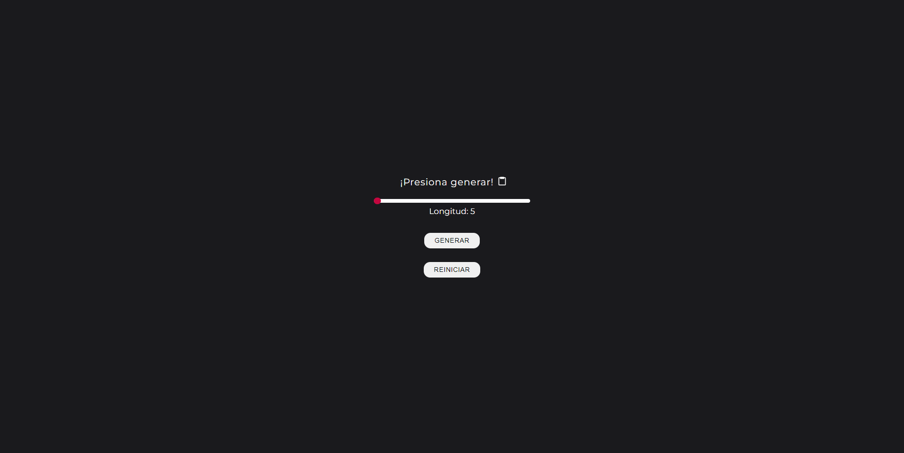
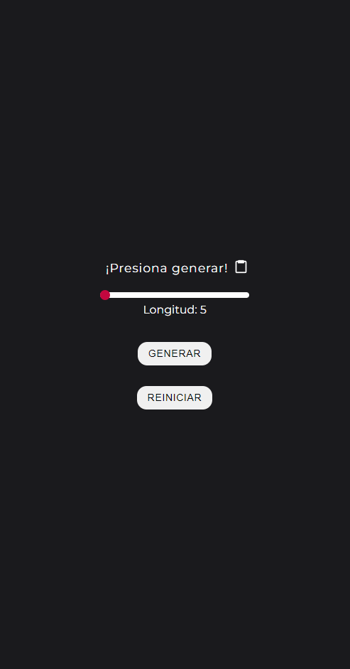
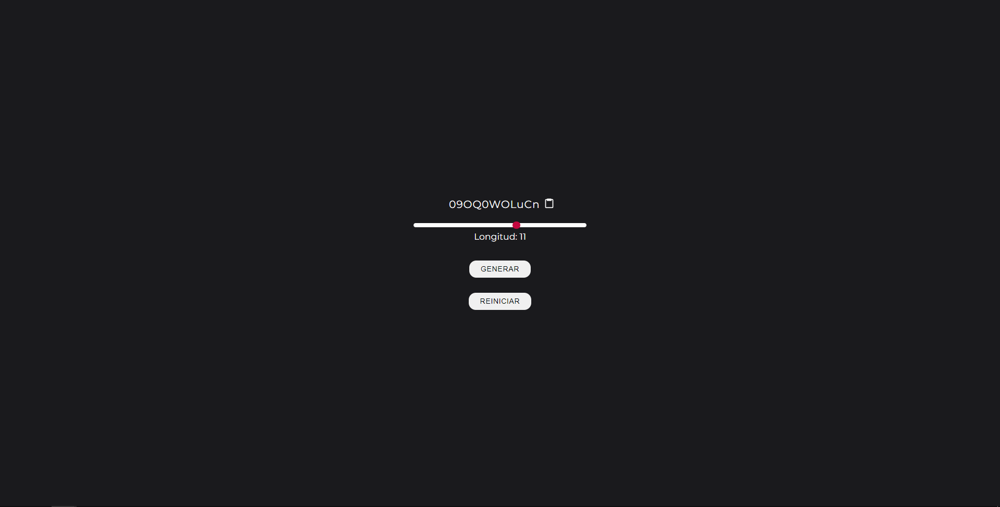

# GENERADOR DE CONTRASEÑAS

:pushpin: Es un proyecto simple sobre el manejo del DOM. Esta realizado usando `<HTML>`, `<CSS>` y `<JS>`.

:pushpin: Se puede elegir el tamaño de la contraseña (del 1 al 15) y generarla. También existe botón para copiar automáticamente
la contraseña.

:pushpin: Se puede reiniciar si ya no se quiere la contraseña generada.

:link: <a href="https://generador-password-carlosmartedev.netlify.app/" target="_BLANK">Ir a la página</a>

## :camera: Imágenes

#### Desktop

#### Mobile

#### Contraseña generada

